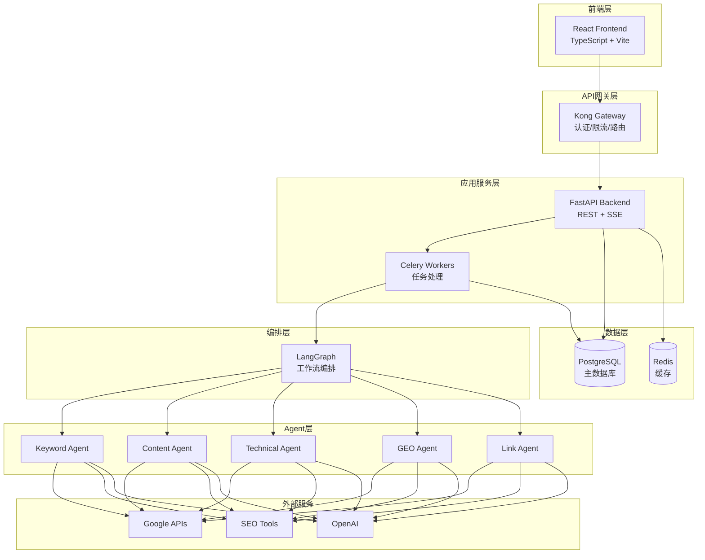
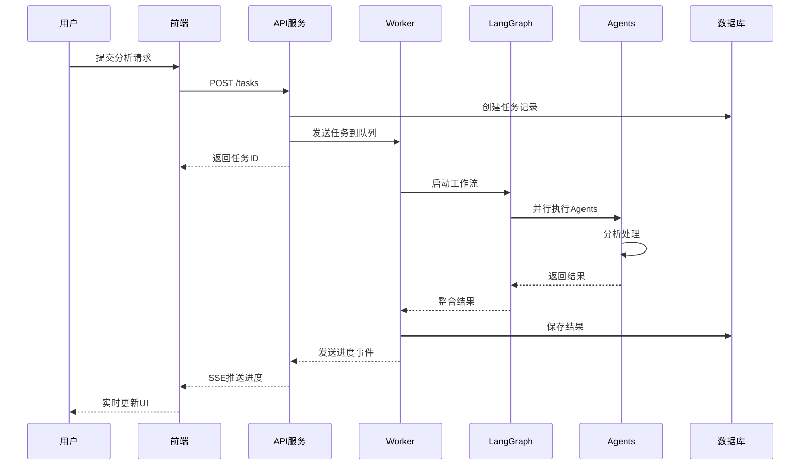
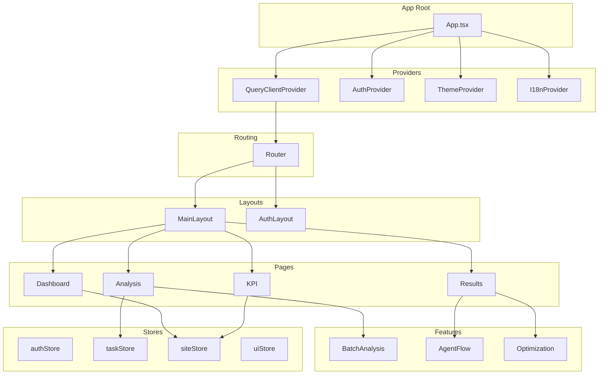
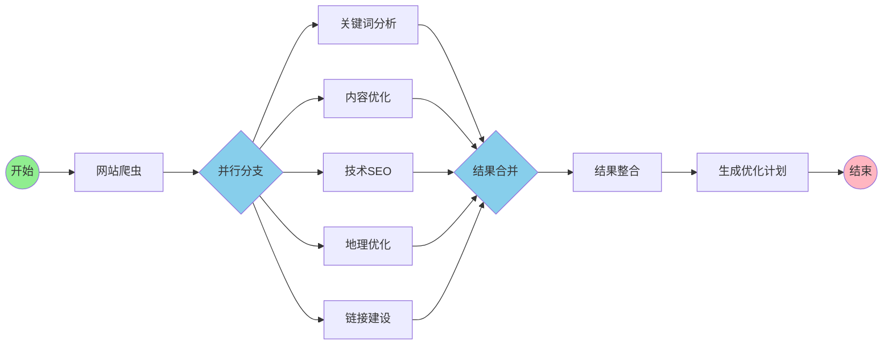
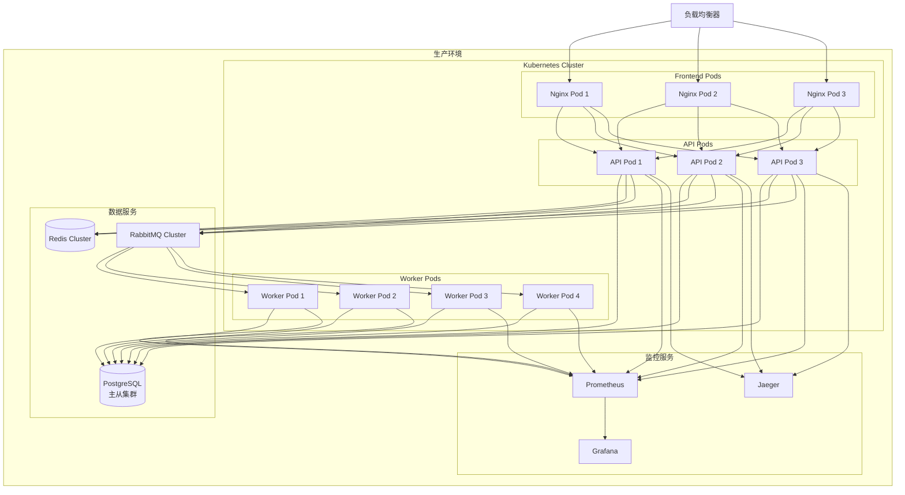
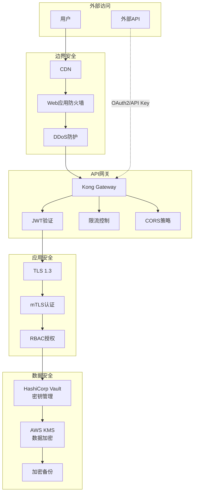
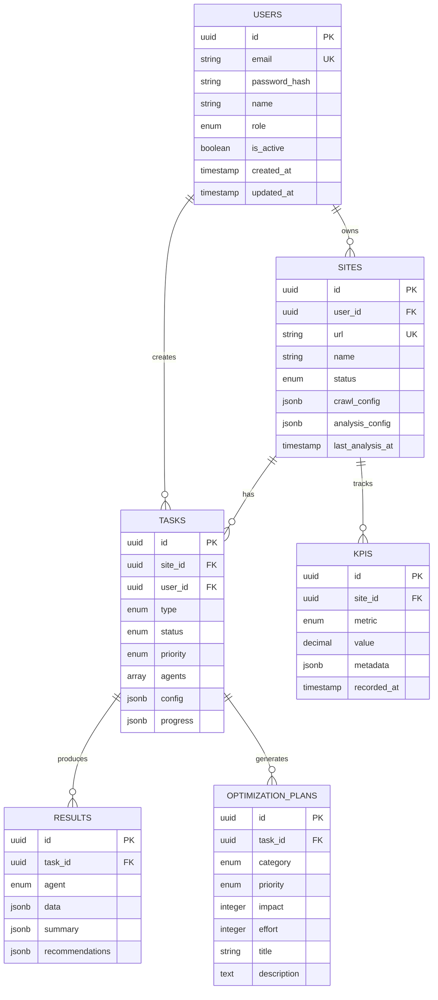

# 系统架构图

> 使用 Mermaid 语法定义的系统架构可视化图表

## 1. 系统整体架构图

## 2. 数据流架构图

## 3. 前端组件架构图

## 4. LangGraph 工作流图

## 5. 部署架构图

## 6. 安全架构图

## 7. 数据模型关系图

## 使用说明

这些架构图使用 Mermaid 语法编写，可以在支持 Mermaid 的环境中渲染显示：

1. **GitHub/GitLab**: 直接在 Markdown 文件中显示
2. **VS Code**: 安装 Mermaid 插件后预览
3. **在线工具**: 使用 [Mermaid Live Editor](https://mermaid-js.github.io/mermaid-live-editor/)
4. **文档工具**: Confluence、Notion 等支持 Mermaid 语法

要导出为图片格式，可以：
- 使用 Mermaid CLI: `mmdc -i input.mmd -o output.png`
- 使用在线编辑器的导出功能
- 截图保存渲染后的图表
